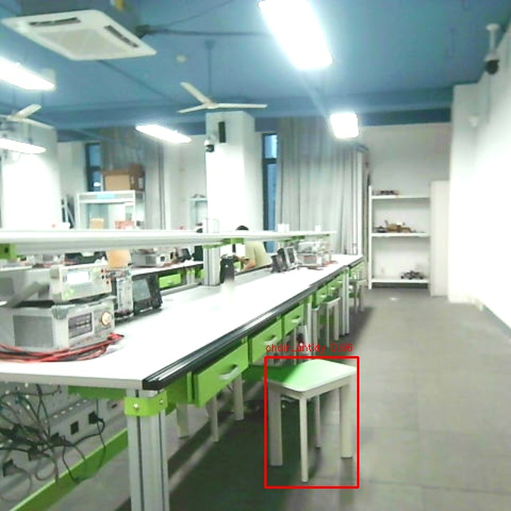
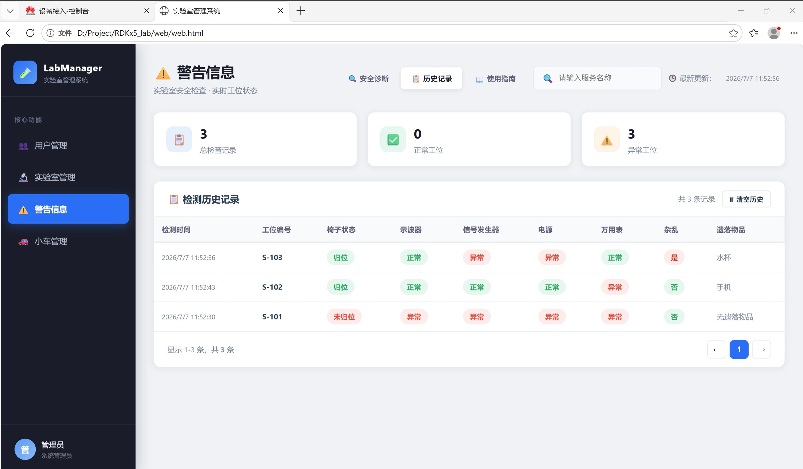

# Smart Lab Inspection System Based on RDKx5

`lab_inspection` is a ROS2 package that implements a smart laboratory inspection system based on RDKx5. It integrates Nav2 navigation, visual inspection, AI inference, Huawei Cloud IoTDA reporting, L610 4G module control, and an optional large model for secondary judgment.

## Main Features

- ROS2 contains `navigation_node` and `vision_node`
- Autonomous cruising based on Nav2: AMCL, map_server, planner, controller, behavior server
- Visual inspection model: `yolov8n.bin`
- Custom `/trigger_inspection` service to trigger inspection
- MQTT reporting via L610 4G module and Huawei IoTDA
- Optional Qwen large model for assisting ambiguous target judgment
- Automatically publish `base_link` → `laser_link` static TF, supporting compatible LiDAR layout

## Repository Structure

- `CMakeLists.txt` — ROS2 package build and installation configuration
- `package.xml` — Package manifest and dependency declaration
- `launch/lab_inspection.launch.py` — Launch robot base, Nav2, vision and navigation nodes
- `config/` — Nav2 parameters, YOLOv8/vision parameters, navigation configuration
- `maps/` — Laboratory map files
- `models/` — Vision model files, supporting `.bin` hardware deployment
- `src/navigation_node.cpp` — C++ navigation node, responsible for inspection station coordination and service interaction
- `src/vision_node.cpp` — C++ vision node, responsible for low-level hardware and inference deployment
- `srv/TriggerInspection.srv` — Custom inspection service definition

## Build Steps

1. Source the ROS2 environment:

```bash
source /opt/ros/<ros2-distro>/setup.bash
```

2. Install system dependencies:

- `ament_cmake`
- `rosidl_default_generators`
- `ament_cmake_python`
- `rclcpp`, `rclpy`, `rclcpp_action`, `rclcpp_components`
- `geometry_msgs`, `sensor_msgs`, `nav_msgs`, `nav2_msgs`, `std_msgs`, `std_srvs`
- `tf2_ros`, `cv_bridge`
- `nlohmann_json`
- `OpenCV`
- `libcurl`

3. Install Python dependencies:

```bash
python3 -m pip install numpy opencv-python pyserial openai
```

4. Build with colcon:

```bash
colcon build --packages-select lab_inspection
```

5. Source the local install:

```bash
source install/setup.bash
```

## Launch

```bash
ros2 launch lab_inspection lab_inspection.launch.py
```

Optional parameters:

```bash
ros2 launch lab_inspection lab_inspection.launch.py initial_x:=0.0 initial_y:=0.0 initial_yaw:=0.0
```

This launch file will:

- Start the robot base bringup, loading camera, LiDAR and IMU
- Publish `base_link` -> `laser_link` static TF
- Start Nav2 stack: map_server, AMCL, planner, controller, behavior server, lifecycle manager
- Start `vision_py.py` visual inspection node
- Start `navigation_node` inspection navigation coordinator node

## Running Services

- `/trigger_inspection` (`lab_inspection/srv/TriggerInspection`) — Initiate visual inspection
- `/start_inspection` — Start inspection process
- `/skip_station` — Skip the current station
- `/connect_huawei_cloud` — Connect to Huawei Cloud
- `/disconnect_huawei_cloud` — Disconnect from Huawei Cloud

`TriggerInspection` service definition:

```srv
int32 station_id
---
bool success
string message
```

## Visual Inspection Results

### Instrument Status and Chair Return Detection

| Scene | Detection Result |
|------|----------|
| Instrument power status | ![results/detection.jpg) |
| Chair not returned | |

### Real-time Web Monitoring



### Model Detection Accuracy (136-image test set)

| Category | English Name | AP@0.5 | GT Count | Rating |
|------|--------|:------:|:-----:|:----:|
| Chair untidy | chair_untidy | **100.0%** | 10 | ✅ Perfect |
| Oscilloscope on | osc_on | **100.0%** | 42 | ✅ Perfect |
| Oscilloscope off | osc_off | **100.0%** | 84 | ✅ Perfect |
| Signal generator on | siggen_on | **90.9%** | 52 | ✅ Excellent |
| Signal generator off | siggen_off | **100.0%** | 74 | ✅ Perfect |
| DC power supply on | psu_on | **90.9%** | 69 | ✅ Excellent |
| DC power supply off | psu_off | 72.7% | 57 | ⚠️ Needs improvement |
| Digital multimeter on | dmm_on | 54.5% | 67 | ⚠️ Needs improvement |
| Digital multimeter off | dmm_off | 63.6% | 59 | ⚠️ Needs improvement |
| Messy desktop | mess | 89.2% | 79 | ✅ Good |
| **Average** | | **86.2%** | 593 | **mAP@0.5** |

## Configuration Files

- `config/nav2_params.yaml` — Nav2 parameters and lifecycle configuration
- `config/navigate_no_replan.xml` — Nav2 behavior tree configuration
- `config/yolov8_config.yaml` — YOLOv8 and visual parameters configuration
- `maps/lab_map.yaml` — Nav2 map file
- `models/yolov8n.bin` — `.bin` visual model

## Hardware Dependency Notes

- Adapted for robot platforms based on RDKx5, compatible with existing robot bringup packages
- When `hb_dnn` library is present, BPU acceleration is supported; x86 platforms can run degraded without BPU
- Requires the robot's camera driver to publish image topics, e.g., `/image`
- Uses L610 4G module and UART control for Huawei Cloud reporting
- Requires Huawei device credentials and Qwen API Key for cloud reporting and optional large model judgment
